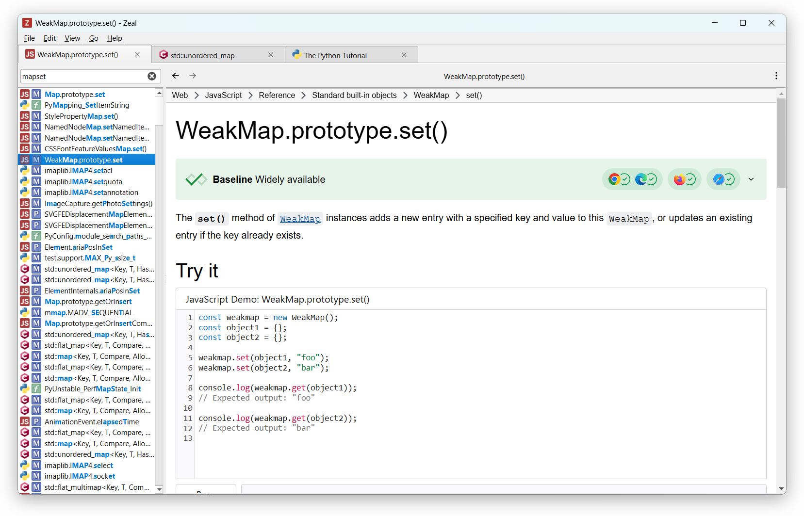

# Zeal

[](https://go.zealdocs.org/l/discord)
[](https://go.zealdocs.org/l/telegram)
[](https://go.zealdocs.org/l/x)

[](https://github.com/zealdocs/zeal/releases)
[](https://github.com/zealdocs/zeal/actions/workflows/build-check.yaml)
[](COPYING)

Zeal is an offline documentation browser: your personal reference library, searchable in an instant and available
without a connection. Originally inspired by [Dash](https://kapeli.com/dash), it supports the same docset format.

<picture>
  <source media="(prefers-color-scheme: dark)" srcset="assets/screenshots/readme-dark.png">
  
</picture>

## Download

<a href="https://flathub.org/apps/org.zealdocs.Zeal">
  
</a>
<a href="https://snapcraft.io/zeal">
  
</a>

Binary builds for Windows and other installation options are available on the
[download page](https://zealdocs.org/download).

## How to use

After installing Zeal, go to `File → Docset Library`, select the docsets you want, and click the `Download` button.

### Query and filter docsets

Limit the search scope by prefixing your query with a docset name and a colon:

`cpp:vector`

To search multiple docsets, separate them with a comma:

`python,django:string`

### Command line

You can also start Zeal with a query from the command line:

`zeal python:pprint`

## How to compile

Detailed, up-to-date build instructions for each platform are available in the
[wiki](https://github.com/zealdocs/zeal/wiki). The bare minimum is described below.

### Build dependencies

* [CMake](https://cmake.org/) and [Ninja](https://ninja-build.org/).
* [Qt](https://www.qt.io/) version 6.4.2 or later. Required modules besides Qt Base: Svg, WebEngine.
* [libarchive](https://libarchive.org/).
* [SQLite](https://sqlite.org/).
* Linux/BSD platforms: `extra-cmake-modules`.
* X11 platforms only: `libxkbcommon`, `xcb-util-keysyms`.

### Build instructions

```shell
cmake --preset release
cmake --build --preset release
```

The resulting binary is `build/release/zeal` (`zeal.exe` on Windows).

## Create your own docsets

Follow the instructions in the [Dash docset generation guide](https://kapeli.com/docsets).

## Contributing

Contributions are welcome. See [CONTRIBUTING.md](CONTRIBUTING.md) for how to build Zeal, the conventions to follow,
and what to expect from review.

## Contact and support

Ways to get help or reach the developers:

* Report bugs and submit feature requests to [GitHub issues](https://github.com/zealdocs/zeal/issues).
* Ask questions in [GitHub discussions](https://github.com/zealdocs/zeal/discussions).
* Chat with developers and other Zeal users on [Discord](https://go.zealdocs.org/l/discord).
* Subscribe to the [Telegram channel](https://go.zealdocs.org/l/telegram) for announcements.
* Follow [@zealdocs](https://go.zealdocs.org/l/x) on X for news and updates.
* Email <support@zealdocs.org> for anything private or sensitive.

## License

This software is licensed under the terms of the GNU General Public License version 3 (GPLv3) or later. Full text of
the license is available in the [COPYING](COPYING) file and [online](https://www.gnu.org/licenses/gpl-3.0.html).

Bundled third-party components are licensed under their respective terms; the repository is
[REUSE](https://reuse.software/)-compliant, with all license texts available in the [LICENSES](LICENSES) directory.
